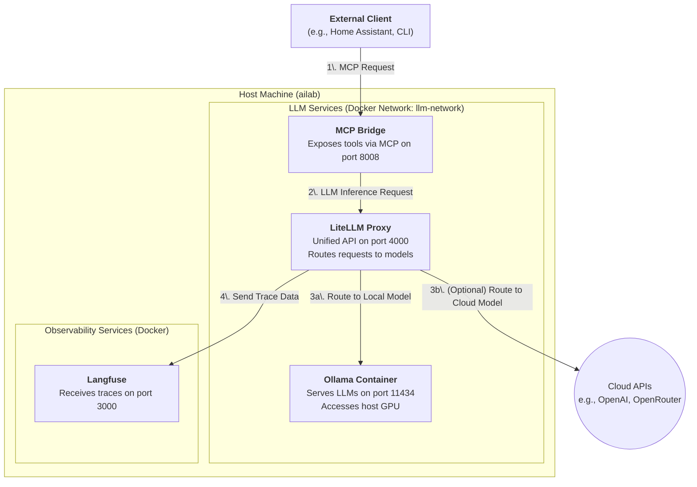

# LLM Role

This Ansible role deploys a comprehensive stack for running and managing local Large Language Models (LLMs). It sets up Ollama for GPU-accelerated model serving, LiteLLM as a unified proxy, MCP-Bridge for tool integration, and Langfuse for observability.

## Architecture

The following diagram illustrates the relationships between the different services deployed by this role.

## Components

### 1. Ollama (`ollama/ollama`)

-   **Purpose**: The core LLM serving engine. It runs specified models (e.g., Mistral, Llama3) and makes them available via an API.
-   **Configuration**:
    -   Runs in a Docker container named `ollama`.
    -   Configured to use the host's NVIDIA GPU for hardware acceleration (`device_requests`).
    -   Model data is persisted on the host at `/opt/ollama`.
    -   Listens on port `11434` within its Docker network.

### 2. LiteLLM Proxy (`ghcr.io/berriai/litellm`)

-   **Purpose**: Provides a unified, OpenAI-compatible API endpoint for all underlying models, whether they are local (from Ollama) or remote (from cloud providers). It simplifies model management and routing.
-   **Configuration**:
    -   Runs in a Docker container named `litellm-proxy-container`.
    -   Configured via `litellm_config.yaml.j2` to know about the `ollama` service and any other models.
    -   Communicates with Ollama over the internal `llm-network`.
    -   Exposes its API on port `4000`.

### 3. MCP-Bridge (`mcp-bridge:ansible-built`)

-   **Purpose**: Implements the [Model-Context-Protocol (MCP)](https://github.com/model-context-protocol/specification) to expose external tools (like Home Assistant, Todoist, web search) to the LLM in a standardized way. This enables the LLM to perform function calling.
-   **Configuration**:
    -   Runs in a Docker container named `mcp-bridge-container`.
    -   The image is built locally from the [MCP-Bridge repository](https://github.com/SecretiveShell/MCP-Bridge).
    -   Configured via `mcp_bridge_config.json.j2` to use LiteLLM as its `inference_server`.
    -   Exposes the MCP endpoint on port `8008`.

### 4. Langfuse (`langfuse/langfuse`)

-   **Purpose**: An open-source observability and analytics platform for LLM applications. It tracks requests, responses, costs, and performance.
-   **Configuration**:
    -   Deployed as a multi-container stack using Docker Compose (`langfuse-docker-compose.yml.j2`).
    -   LiteLLM is configured to send all trace data to the Langfuse endpoint (`http://ailab.lan:3000`).
    -   Provides a web UI on port `3000` for viewing traces and analytics.

## Workflow

1.  An **External Client** sends a request to the **MCP Bridge** on port `8008`. This request typically includes a prompt and a list of available tools.
2.  The **MCP Bridge** forwards the prompt and tool definitions to its configured inference server, **LiteLLM**, for processing.
3.  **LiteLLM** routes the request.
    a.  If the target model is local (e.g., `home-local`), it sends the request to the **Ollama** container.
    b.  If the target model is a cloud service, it sends the request to the appropriate external API.
4.  Simultaneously, **LiteLLM** sends detailed trace information about the request/response cycle to **Langfuse** for logging and analysis.

This setup provides a powerful, flexible, and observable environment for developing and running LLM-powered applications.
