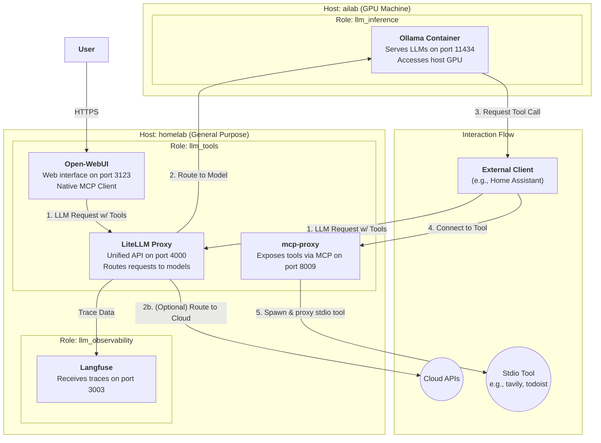

# LLM Tools Role

This Ansible role deploys the user-facing and middleware components of the LLM stack. It is designed to run on a general-purpose host (like `homelab`) and connects to a dedicated, GPU-powered machine running the inference engine.

Specifically, this role deploys:
-   **LiteLLM:** A unified proxy to manage and route requests to various LLM providers.
-   **mcp-proxy:** A proxy server that exposes multiple stdio-based [Model-Context-Protocol (MCP)](https://github.com/model-context-protocol/specification) tool servers over a unified HTTP SSE endpoint.
-   **Open-WebUI:** A user-friendly web interface for chatting with local models, with native MCP support.

This role works in conjunction with:
-   `llm_inference` role: Deploys the Ollama inference server on a GPU host (`ailab`).
-   `llm_observability` role: Deploys the Langfuse observability stack (`homelab`).

## Architecture

The following diagram illustrates the relationships between the different services and the hosts they run on.

## Deployed by this Role (`llm_tools` on `homelab`)

### 1. LiteLLM Proxy (`ghcr.io/berriai/litellm`)

-   **Purpose**: Provides a unified, OpenAI-compatible API endpoint for all underlying models, whether they are local (from Ollama) or remote (from cloud providers). It simplifies model management and routing.
-   **Configuration**:
    -   Runs in a Docker container named `litellm-proxy-container`.
    -   Configured via `litellm_config.yaml.j2` to connect to Ollama on `ailab.lan:11434` and Langfuse on `homelab-nuc.lan:3003`.
    -   Exposes its API on port `4000`.

### 2. mcp-proxy (`mcp-proxy:custom`)

-   **Purpose**: Implements the server-side of the [Model-Context-Protocol (MCP)](https://github.com/model-context-protocol/specification). It listens for HTTP connections and proxies them to various backend tool servers that communicate over `stdio`. This allows clients like Open-WebUI and Home Assistant to access a suite of tools through a single endpoint.
-   **Configuration**:
    -   Runs in a Docker container named `mcp-proxy`.
    -   The image is custom-built to include necessary runtimes like `uv` and `npx` for the tool servers.
    -   Configured via `servers.json` which lists all available tool servers (e.g., fetch, Home Assistant, Tavily, Todoist).
    -   Exposes the MCP endpoint on port `8009`.

### 3. Open-WebUI (`ghcr.io/open-webui/open-webui`)

-   **Purpose**: A user-friendly web interface for chatting with LLMs, with integrated MCP support.
-   **Configuration**:
    -   Runs in a Docker container named `open-webui`.
    -   Configured to communicate with an LLM backend (Ollama via `OLLAMA_BASE_URL`).
    -   Configured to use `mcp-proxy` for tool access (via `MCP_SERVER` environment variable).
    -   Exposed on port `3123`.

## External Dependencies (Deployed by other roles)

### 1. Ollama (`llm_inference` role on `ailab`)

-   **Purpose**: The core LLM serving engine. It runs specified models (e.g., Mistral, Llama3) and makes them available via an API.
-   **Configuration**:
    -   Runs in a Docker container named `ollama` on the `ailab` host.
    -   Configured to use the host's NVIDIA GPU for hardware acceleration.
    -   Model data is persisted on the host at `{{ ollama_models_path }}` (e.g., `/home/daniel/ollama`).
    -   Listens on port `11434`.

### 2. Langfuse (`llm_observability` role on `homelab`)

-   **Purpose**: An open-source observability and analytics platform for LLM applications. It tracks requests, responses, costs, and performance.
-   **Configuration**:
    -   Deployed as a multi-container stack using Docker Compose on the `homelab` host.
    -   LiteLLM is configured to send all trace data to the Langfuse endpoint.
    -   Provides a web UI on port `3003`.

## Workflow

1.  A **User** or **Client** (like Home Assistant) initiates a chat or task. They act as an MCP client.
2.  The client sends the prompt to an LLM, typically through the **LiteLLM** proxy.
3.  The LLM processes the prompt. If it decides to use a tool, its response will instruct the client to connect to a specific tool server.
4.  The client (e.g., OpenWebUI) then makes a connection to the **mcp-proxy** service on `homelab:8009` to interact with the requested tool.
5.  **mcp-proxy** receives the connection, spawns the correct backend stdio tool server (e.g., `tavily-mcp`), and proxies the communication.
6.  All LLM interactions that go through **LiteLLM** are traced and sent to **Langfuse** for observability.

This distributed setup separates the GPU-intensive workload from the lighter management services, providing a powerful, flexible, and observable environment for developing and running LLM-powered applications.
