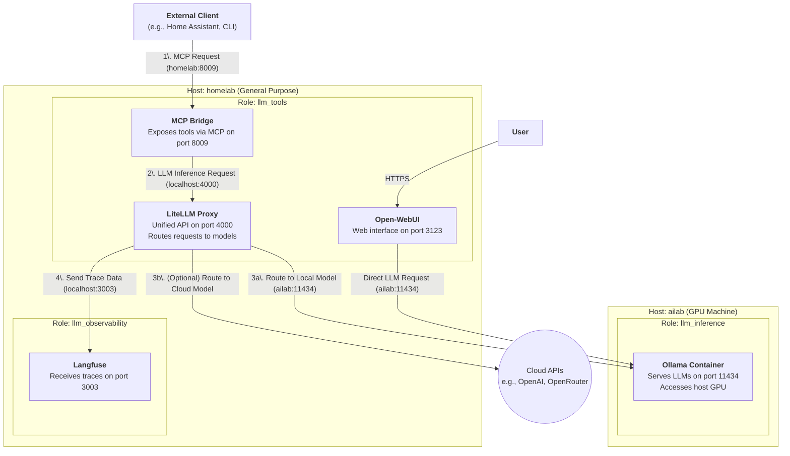

# LLM Tools Role

This Ansible role deploys the user-facing and middleware components of the LLM stack. It is designed to run on a general-purpose host (like `homelab`) and connects to a dedicated, GPU-powered machine running the inference engine.

Specifically, this role deploys:
-   **LiteLLM:** A unified proxy to manage and route requests to various LLM providers.
-   **MCP-Bridge:** A server that exposes external tools to LLMs using the Model-Context-Protocol (MCP).
-   **Open-WebUI:** A user-friendly web interface for chatting with local models.

This role works in conjunction with:
-   `llm_inference` role: Deploys the Ollama inference server on a GPU host (`ailab`).
-   `llm_observability` role: Deploys the Langfuse observability stack (`homelab`).

## Architecture

The following diagram illustrates the relationships between the different services and the hosts they run on.

## Deployed by this Role (`llm_tools` on `homelab`)

### 1. LiteLLM Proxy (`ghcr.io/berriai/litellm`)

-   **Purpose**: Provides a unified, OpenAI-compatible API endpoint for all underlying models, whether they are local (from Ollama) or remote (from cloud providers). It simplifies model management and routing.
-   **Configuration**:
    -   Runs in a Docker container named `litellm-proxy-container`.
    -   Configured via `litellm_config.yaml.j2` to connect to Ollama on `ailab.lan:11434` and Langfuse on `homelab-nuc.lan:3003`.
    -   Exposes its API on port `4000`.

### 2. MCP-Bridge (`mcp-bridge:ansible-built`)

-   **Purpose**: Implements the [Model-Context-Protocol (MCP)](https://github.com/model-context-protocol/specification) to expose external tools (like Home Assistant, Todoist, web search) to the LLM in a standardized way. This enables the LLM to perform function calling.
-   **Configuration**:
    -   Runs in a Docker container named `mcp-bridge-container`.
    -   The image is built locally from the [MCP-Bridge repository](https://github.com/SecretiveShell/MCP-Bridge).
    -   Configured via `mcp_bridge_config.json.j2` to use LiteLLM as its `inference_server`.
    -   Exposes the MCP endpoint on port `8009`.

### 3. Open-WebUI (`ghcr.io/open-webui/open-webui`)

-   **Purpose**: A user-friendly web interface for chatting with LLMs.
-   **Configuration**:
    -   Runs in a Docker container named `open-webui`.
    -   Configured to communicate directly with the Ollama API on `ailab.lan:11434`.
    -   Exposed on port `3123`.

## External Dependencies (Deployed by other roles)

### 1. Ollama (`llm_inference` role on `ailab`)

-   **Purpose**: The core LLM serving engine. It runs specified models (e.g., Mistral, Llama3) and makes them available via an API.
-   **Configuration**:
    -   Runs in a Docker container named `ollama` on the `ailab` host.
    -   Configured to use the host's NVIDIA GPU for hardware acceleration.
    -   Model data is persisted on the host at `{{ ollama_models_path }}` (e.g., `/home/daniel/ollama`).
    -   Listens on port `11434`.

### 2. Langfuse (`llm_observability` role on `homelab`)

-   **Purpose**: An open-source observability and analytics platform for LLM applications. It tracks requests, responses, costs, and performance.
-   **Configuration**:
    -   Deployed as a multi-container stack using Docker Compose on the `homelab` host.
    -   LiteLLM is configured to send all trace data to the Langfuse endpoint.
    -   Provides a web UI on port `3003`.

## Workflow

1.  An **External Client** (like Home Assistant) sends a request to the **MCP Bridge** on `homelab:8009`. This request typically includes a prompt and a list of available tools.
2.  The **MCP Bridge** forwards the prompt and tool definitions to its configured inference server, **LiteLLM**, on `localhost:4000`.
3.  **LiteLLM** routes the request:
    a.  If the target model is local (e.g., `home-local`), it sends the request across the LAN to the **Ollama** container on `ailab:11434`.
    b.  If the target model is a cloud service, it sends the request to the appropriate external API.
4.  Simultaneously, **LiteLLM** sends detailed trace information about the request/response cycle to **Langfuse** on `localhost:3003` for logging and analysis.
5.  A **User** can interact with models directly through **Open-WebUI** (`homelab:3123`), which connects to **Ollama** on `ailab:11434`.

This distributed setup separates the GPU-intensive workload from the lighter management services, providing a powerful, flexible, and observable environment for developing and running LLM-powered applications.
