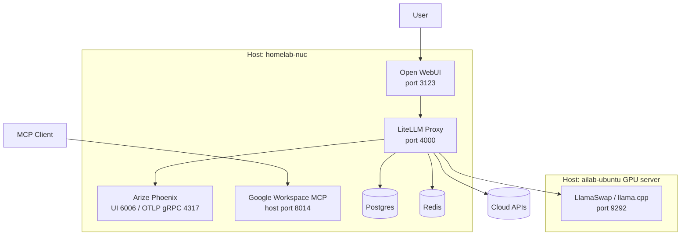

# LLM Tools Role

This role deploys the user-facing and middleware parts of the LLM stack on `homelab-nuc`. GPU inference itself runs on `ailab-ubuntu` via the `llm_inference` role.

## Deployed by this role

- **LiteLLM Proxy** (`litellm-proxy-container`): OpenAI-compatible API and admin UI on `{{ litellm_proxy_port }}` / `https://litellm.kirelabs.org`.
- **LiteLLM Postgres + Redis**: database and cache for LiteLLM, managed in the same Compose project.
- **Open WebUI** (`open-webui`): chat UI on `{{ open_webui_http_port }}` / `https://open-webui.kirelabs.org`.
- **Google Workspace MCP** (`google-workspace-mcp`): streamable HTTP MCP server on `{{ google_workspace_mcp_port_host }}` / `https://google-workspace-mcp.kirelabs.org`.
- **autoheal**: restarts unhealthy LiteLLM-related containers.

The old standalone `mcp-proxy` container is no longer deployed. MCP servers are configured directly in `litellm_config.yaml.j2`, and additional MCP aggregation is handled outside this role (for example via MetaMCP).

## Related roles

- `llm_inference` on `ailab-ubuntu`: builds and runs **LlamaSwap** backed by `llama.cpp` servers. LiteLLM routes local models to `http://{{ llm_inference_host }}:{{ llamaswap_port }}/v1`.
- `llm_observability` on `homelab-nuc`: deploys **Arize Phoenix**. LiteLLM sends traces with the `arize_phoenix` callback to `{{ phoenix_host_for_litellm }}`.

## Architecture


```mermaid
graph TD
    subgraph "Host: ailab-ubuntu GPU server"
        LlamaSwap["LlamaSwap / llama.cpp<br>port 9292"]
    end

    subgraph "Host: homelab-nuc"
        LiteLLM["LiteLLM Proxy<br>port 4000"]
        OpenWebUI["Open WebUI<br>port 3123"]
        Phoenix["Arize Phoenix<br>UI 6006 / OTLP gRPC 4317"]
        WorkspaceMCP["Google Workspace MCP<br>host port 8014"]
        DB[(Postgres)]
        Redis[(Redis)]
    end

    User --> OpenWebUI
    OpenWebUI --> LiteLLM
    LiteLLM --> LlamaSwap
    LiteLLM --> CloudAPIs[(Cloud APIs)]
    LiteLLM --> Phoenix
    LiteLLM --> DB
    LiteLLM --> Redis
    Client["MCP Client"] --> WorkspaceMCP
```

## LiteLLM configuration

`templates/litellm_config.yaml.j2` renders:

- local LlamaSwap models from `group_vars/all/llms.yml`, including variants such as `ha`, `openclaw`, `misc`, and `nothink`;
- cloud models using vaulted provider API keys;
- fallbacks from `litellm_fallbacks`;
- MCP server definitions for fetch, Tavily, Home Assistant, Immich, n8n, Todoist, GitHub Copilot, Google Maps, Notion, Bring, and Craft where configured.

If `/health/readiness` reports `Not connected to the query engine`, restart `litellm-proxy-container`; this usually triggers the Prisma migration path.

## Deployment

```bash
uv run ansible-playbook setup.yml --tags llm-tools --limit homelab
```

Deploy related pieces with:

```bash
uv run ansible-playbook setup.yml --tags llm-inference --limit ailab_ubuntus
uv run ansible-playbook setup.yml --tags llm-observability --limit homelab
```
