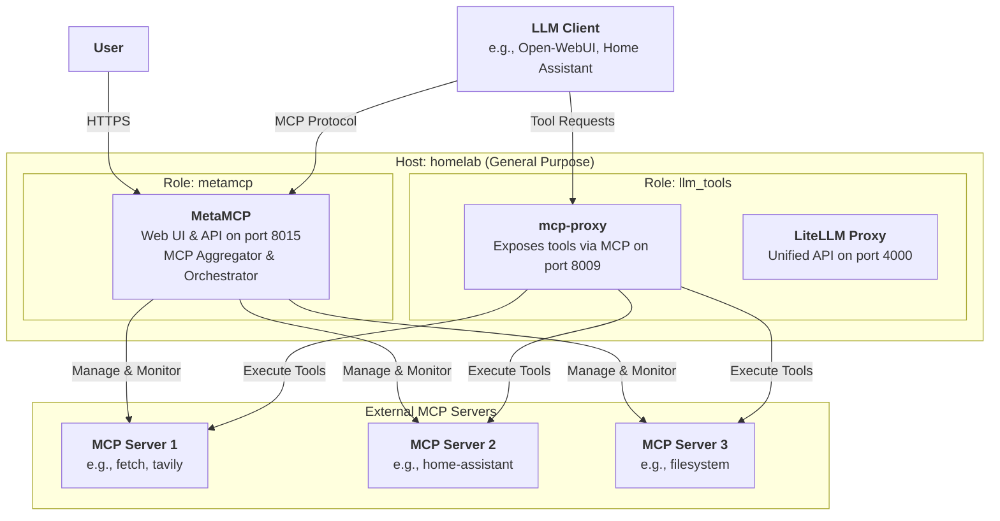

# MetaMCP Role

This Ansible role deploys **MetaMCP**, an all-in-one MCP (Model Context Protocol) aggregator, orchestrator, middleware, and gateway solution. It provides a unified interface to manage and interact with multiple MCP servers through a single web application.

## Overview

MetaMCP is a comprehensive MCP management platform that:
- **Aggregates** multiple MCP servers into a single interface
- **Orchestrates** tool execution across different MCP servers
- **Provides** a web-based UI for managing MCP configurations
- **Enables** OAuth authentication for secure access
- **Supports** multiple authentication providers (GitHub, Google, Microsoft)

## Architecture



## What MetaMCP Does

**MetaMCP** serves as a central management and orchestration layer for your MCP infrastructure:

1. **Unified Management**: Manage all your MCP servers from a single web interface
2. **Tool Orchestration**: Coordinate tool execution across multiple MCP servers
3. **MCP Gateway**: Act as a gateway for MCP clients to discover and use tools
4. **Monitoring & Observability**: Monitor MCP server health and tool usage
5. **Configuration Management**: Dynamically configure MCP servers without restarts

## Deployed Services

### MetaMCP Container (`metatoolai/metamcp:latest`)

- **Purpose**: All-in-one MCP management platform
- **Container Name**: `metamcp`
- **Network**: Connected to `llm-network` (shared with llm_tools)
- **Web UI**: Available on port 8015 (mapped to container port 3000)
- **Configuration**: Managed via templated `.env` file
- **Authentication**: Optional OAuth support (GitHub, Google, Microsoft)

## Configuration

### Basic Configuration (defaults/main.yml)

```yaml
# Network
metamcp_network_name: "llm-network"

# Container settings
metamcp_image: "metatoolai/metamcp:latest"
metamcp_container_name: "metamcp"
metamcp_port_host: 8015
metamcp_port_container: 3000

# Network and Container Settings
metamcp_network_name: "llm-network"
metamcp_image: "metatoolai/metamcp:latest"
metamcp_port_host: 8015
metamcp_port_container: 3000
```

### OAuth Configuration (Optional)

To enable OAuth authentication, set the following variables:

```yaml
# Enable OAuth
metamcp_oauth_enabled: true

# GitHub OAuth
metamcp_oauth_github_client_id: "your_github_client_id"
metamcp_oauth_github_client_secret: "your_github_client_secret"

# Google OAuth
metamcp_oauth_google_client_id: "your_google_client_id"
metamcp_oauth_google_client_secret: "your_google_client_secret"

# Microsoft OAuth
metamcp_oauth_microsoft_client_id: "your_microsoft_client_id"
metamcp_oauth_microsoft_client_secret: "your_microsoft_client_secret"
```

### Service Integration

MetaMCP is designed to work alongside other LLM tools:

- **With mcp-proxy** (llm_tools role): MetaMCP can manage the tools exposed by mcp-proxy
- **With LiteLLM** (llm_tools role): Provides unified LLM access with tool capabilities
- **With Open-WebUI** (llm_tools role): Open-WebUI can use tools managed by MetaMCP

## Deployment

### Add to setup.yml

Include the metamcp role in your `setup.yml`:

```yaml
- name: Deploy MetaMCP
  hosts: homelab
  roles:
    - metamcp
  tags:
    - metamcp
```

### Run the Playbook

```bash
# Full deployment
uv run ansible-playbook setup.yml --tags metamcp

# With check mode (dry run)
uv run ansible-playbook setup.yml --tags metamcp --check --diff
```

## Accessing MetaMCP

### Web Interface

Once deployed, access MetaMCP at:
- **URL**: https://metamcp.lan
- **Port**: 8015

### Authentication

- **Without OAuth**: Direct access (development only)
- **With OAuth**: Sign in with configured provider (GitHub, Google, or Microsoft)

## Configuration

### Environment Variables

The role configures MetaMCP through environment variables passed directly to the Docker container:

**Core Environment Variables:**
- `PORT`: Container port (default: 3000)
- `NODE_ENV`: Environment mode (default: production)
- `SESSION_SECRET`: Session encryption secret

**OAuth Variables (when enabled):**
- `OAUTH_GITHUB_CLIENT_ID`: GitHub OAuth client ID
- `OAUTH_GITHUB_CLIENT_SECRET`: GitHub OAuth client secret
- `OAUTH_GOOGLE_CLIENT_ID`: Google OAuth client ID
- `OAUTH_GOOGLE_CLIENT_SECRET`: Google OAuth client secret
- `OAUTH_MICROSOFT_CLIENT_ID`: Microsoft OAuth client ID
- `OAUTH_MICROSOFT_CLIENT_SECRET`: Microsoft OAuth client secret
- `OAUTH_ALLOWED_DOMAINS`: Comma-separated list of allowed domains

**Redis Variable (when enabled):**
- `REDIS_URL`: Redis connection URL for session persistence

### Configuration Priority

The role uses the standard Ansible variable hierarchy:

1. **Host variables** (highest priority)
2. **Group variables** (`group_vars/all/config.yml`)
3. **Role defaults** (lowest priority - `roles/metamcp/defaults/main.yml`)

To customize, override variables in your inventory or group variables.

## Integration with Homepage

MetaMCP is automatically integrated into the Homepage dashboard with the following labels:

```yaml
homepage.group: "{{ services['metamcp'].group }}"
homepage.name: "{{ services['metamcp'].name }}"
homepage.href: https://metamcp.lan
homepage.icon: gateway.png
homepage.server: "{{ inventory_hostname }}"
homepage.container: "metamcp"
```

## Troubleshooting

### Check Container Status

```bash
ssh nuc "docker ps | grep metamcp"
```

### View Logs

```bash
ssh nuc "docker logs -f metamcp"
```

### Restart Container

```bash
ssh nuc "docker restart metamcp"
```

### Check Environment Variables

```bash
# View running container environment
ssh nuc "docker inspect metamcp | grep -A 20 Env"
```

## Related Roles

- **`llm_tools`**: Deploys mcp-proxy, LiteLLM, and Open-WebUI
- **`llm_inference`**: Deploys Ollama for local LLM inference
- **`llm_observability`**: Deploys Langfuse for observability

## Notes

- MetaMCP reuses the `llm-network` for compatibility with other LLM tools
- Configuration is managed through Ansible variables - re-run the playbook to apply changes
- OAuth is optional and can be enabled per deployment
- Redis support is available for session persistence (requires additional Redis deployment)
- The role includes Homepage dashboard integration labels for seamless UI access
